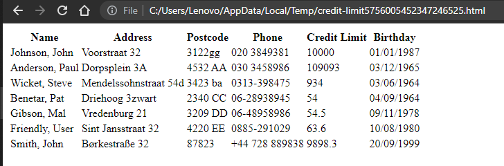

# BETest

## Why?

We are interested in your skills as a developer. As part of our assessment, we want to see your code.

## Instructions

In this repo, you'll find two files, `Workbook2.csv` and `Workbook2.prn`. These files need to be converted to an HTML format
by the code you deliver. Please consider your work as a proof of concept for a system that can report credit
limits from several sources.

This repository is created specially for you, so you can push anything you like. Please update this README to provide
instructions, notes and/or comments for us.

## Hints

* Treat this exercise as you would the creation of a minimum viable product at work.
* There are two different input files. Your application needs to be able to parse both types of file. 
* The processing of each file should produce one file containing an HTML representation of the contents of the input file.
* The HTML files generated by your application will be used to review the credit limits from the different files.
* There's no need to add a database, webservice or queues, but it may be worth thinking about how such things could be added 
to your solution in the future if we wanted to.
* No need spend a long time on the HTML formatting, e.g. elaborate CSS formatting is not necessary.
* Consider the input files as coming from an external source; they should not be altered.
* We appreciate you have little time, so focus on the basics.

## The Constraints

Please complete the test within 5 business days. Use either Java, Scala or Kotlin. Use any libs / tools you like.

## Questions?

If you have any questions please send an email to DL-eCG-NL-assessment@eclassifiedsgroup.com.

## Finished?

Please send an email to DL-eCG-NL-assessment@eclassifiedsgroup.com let us know you're done.

Good Luck!

Copyright (C) 2001 - 2021 by Marktplaats BV an Adevinta company. All rights reserved.

--------------------------------------------------------------------------------------------------------------------
## Solution Approach & Notes

* Please refer <code> src/test/java/HtmlParserTest.java </code> for driver code with different test cases
* I've implemented solution with pure core java, spring framework can be added if required for API based entry point
* Please note html file path printed on console logs (I've considered default user dir)
* Classes implemented with single responsibility principle
* More file input parsers can be added by just extending <code> FileParserAbstract </code> class, thus promoting code reusability
* Entrypoint like webservice, db, API can be done on <code> HtmlPageGeneratorServiceImpl </code> service class by writing wrapper classes

## Output Snapshots

Generate HTML page from CSV file

Generate HTML page from PRN file

